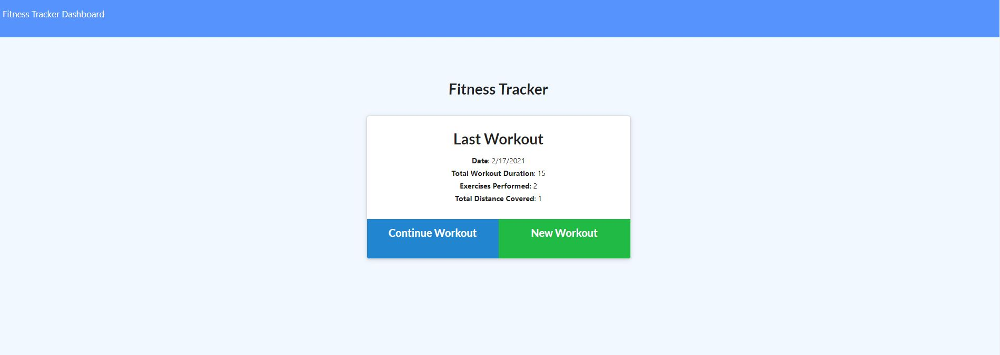
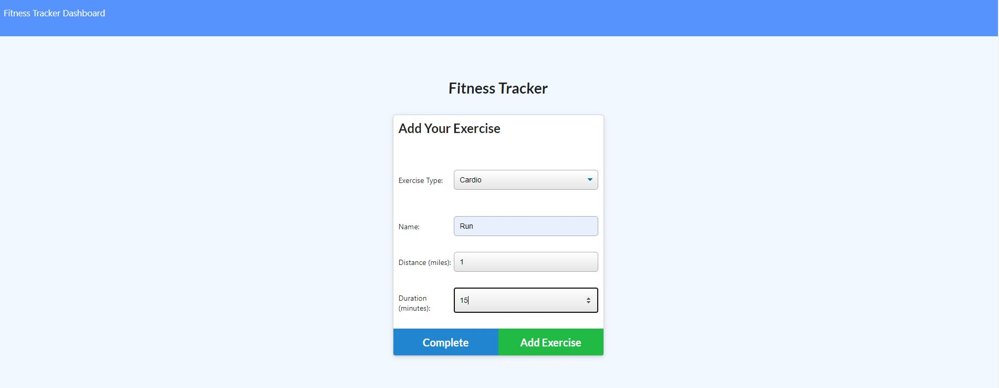
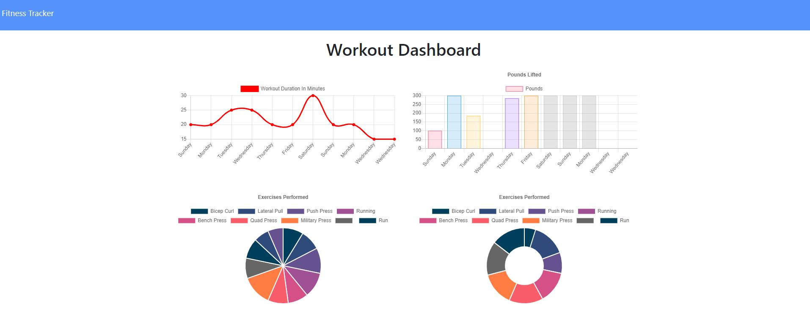

# Fitness Tracker

  
## Description
  For this project, I was tasked with creating a fitness tracker that would allow the user to create new workouts, add exercises to existing workouts and track their progress. When a user opens the app, they wil be presented with the most recent workout information and can choose to continue this workout or create a new one.  

## Table of Contents
- [Description](#description)
- [Installation](#installation)
- [Examples](#examples)
- [License](#license)
- [Links](#links)
  
## Installation
  To install this application, run npm install to install the nessecary modules. Next run npm run seed to seed your Mongo database. 

  
## Examples
    Home Screen

    Adding Exercise

    Dashboard

## License
  MIT
  
  
## Questions

  If you have any questions, please feel free to contact me on github.

  Github:kaileesmith

## Links

Deployed Link: https://pacific-lake-49703.herokuapp.com/